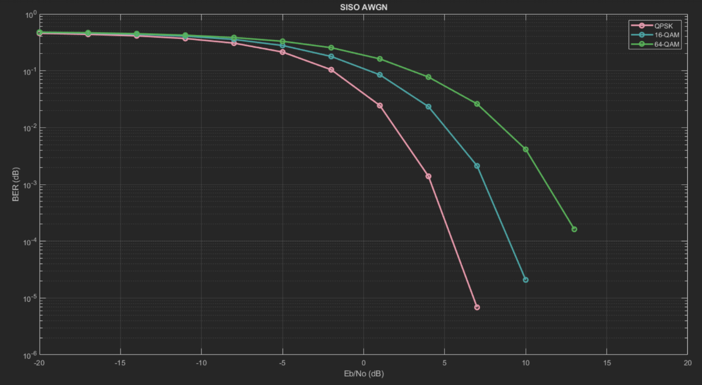

# OFDM-Digital-Communication-System
The aim of the project is to build a semi-complete digital communication system based on OFDM -Orthogonal Frequency Division Multiplexing- refers to a communication scheme in which the transmitted data are split into parallel streams. Streams are modulated on orthogonal sub-carriers, therefore it consists of building multiple separate communication blocks that work in sequence.
 
 

# How to run our code
The are 4 branches in this repo:
- QAM-SIMO
- QAM-SISO
- QPSK-SISO-SIMO
- main

Inside each branch of the first 3 branches exists the developed code for the branch task, for exaple, for the first branch (`QAM-SIMO`) inside it exists a number of developed scripts to implement the QAM modlation and demodulation and a `main.m`, the `main.m` is the file to run. 

In the `main` branch exists a `driver.m` file which is a `GUI` that lets you chosse which modulation type and which reciver configration to run the simulation on.

 
 

>Next is a brief explanation of each block used in the OFDM digital communication system.

 

# Transmitter

### **Channel coding**
Channel coding technique of choice was Hamming linear block code
- Hamming codes are expressed as a function of a single integer m ≥ 2

### **Symbol mapper** 
Symbol mapper is the modulation used, usually OFDM is done with QPSK and QAM modulation in modern applications such as WI-FI, it uses 64, 256 and 1024 QAM. 
- QPSK
  
- QAM
  

### **IFFT**
OFDM in digital communication is implemented using the IDFT.

- The advantage of this operation is that it can be efficiently computed using algorithms such as FFT. The output of IFFT is called `The OFDM symbols`
- One OFDM symbol carries `Nc` data symbols.
- IFFT black consist of a number of sub-blocks like `serial to parallel` which splits the modulated symbols into `Nc` separate symbols to carry each symbol on a different carrier.  
- Cyclic prefix is added to prevent inter-symbol interference. 
- The signal is then converted to serial stream of symbols again and passed to a `D/A` to transmit with the antenna.

>The signal is now in the air and will suffer from noise and channel effects, in this project we investigate with two types of channels **Additive White Gaussian Noise channel and Multi-Path Fading Channel**

 
 
 

# Receiver

>There are different variations of communication setups:
» Single-Input-Single-Output (**SISO**), Single-Input-Multiple-Output (**SIMO**)
» Multiple-Input-Single-Output (**MISO**), Multiple-Input-Multiple-Output (**MIMO**)

In this project we focus on SISO and SIMO

 
At the receiver we can construct the constellation diagram to get some sense of the noise and channel effect.

As we can see as the SNR increases (noise decreases) the optimal receiver detection performance increases. This figures was taken for 64-QAM.
 
 
 

# Performance Curves

For each modulation type we have 4 graphs, two graphs for each channel type (each channel two receivers types SISO and SIMO). 

All following performance curves are with: `L = 50`, `No. of frames = 30`, `OFDM symbols = 100`.

### **QPSK**

### **QAM16**

### **QAM64**

### **SISO-AWGN**

### **SIMO-AWGN**

### **SISO-Multipath**

### **SIMO-Multipath**

# Team members

